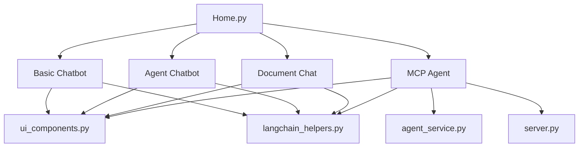
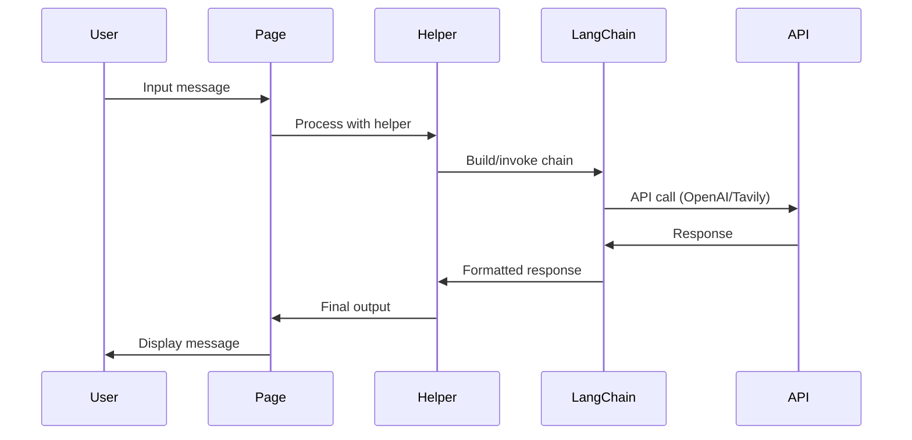
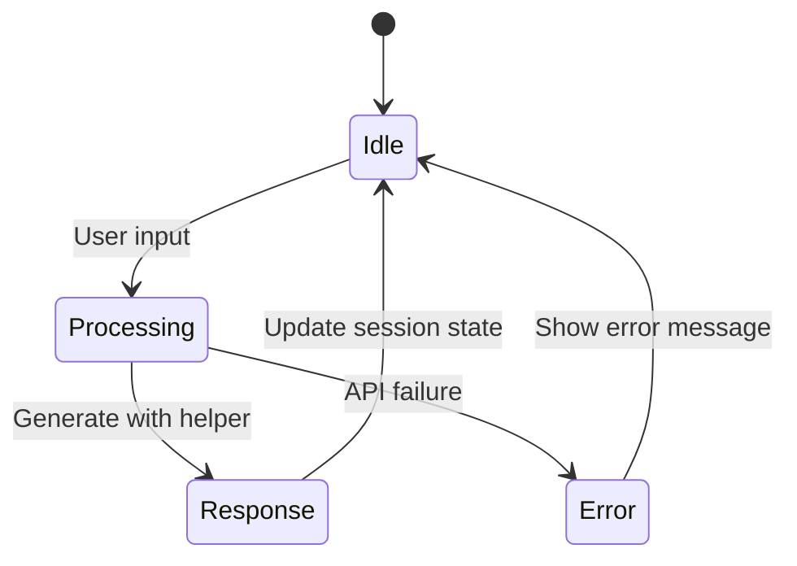
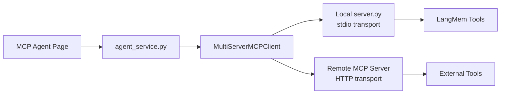

# Code Architecture

## System Overview

The LLM Bootcamp project implements a chatbot architecture with 4 applications and separation of concerns.



## Core Components

### 1. UI Layer (`ui_components.py`)

**ChatbotUI Class:**
- Chat interface components
- Avatar management with SVG emoji rendering
- Page setup and styling systems

**APIKeyUI Class:**
- API key input forms with validation
- Credential management

### 2. Business Logic (`langchain_helpers.py`)

**Helper Classes:**
- `BasicChatbotHelper`: Conversation AI with memory
- `AgentChatbotHelper`: Web search integration via Tavily
- `RAGHelper`: PDF document processing with FAISS
- `MCPHelper`: Model Context Protocol integration
- `ValidationHelper`: Input validation

### 3. MCP Integration

**agent_service.py:**
- MCPAgent class for MCP client connections
- Multi-server configuration support
- Async agent processing

**server.py:**
- FastMCP server implementation
- LangMem prompt optimization tools
- Stdio transport support

## Data Flow



## Memory Architecture

### Session State Management
Each chatbot maintains isolated state:
- `basic_messages`: Basic chatbot conversations
- `agent_messages`: Agent chatbot with search
- `rag_messages`: Document chat conversations
- `mcp_messages`: MCP agent conversations

### Processing Flow


## MCP Architecture

### Client-Server Model


### Tools Integration
- **Local**: Prompt optimization via LangMem
- **Remote**: External MCP server tools
- **Transport**: Stdio for local, HTTP for remote

## File Organization

```
project_code/
├── Home.py                 # Main app entry
├── pages/                  # Individual chatbot pages
│   ├── 1_Basic_Chatbot.py
│   ├── 2_Chatbot_Agent.py
│   ├── 3_Chat_with_your_Data.py
│   └── 4_MCP_Agent.py
├── ui_components.py        # UI layer
├── langchain_helpers.py    # Business logic
├── agent_service.py        # MCP client
├── server.py              # MCP server
└── requirements.txt        # Dependencies
```

## Key Design Patterns

### Separation of Concerns
- **UI**: Streamlit components, styling, user interaction
- **Business Logic**: LangChain integration, API calls
- **Validation**: Input checking, error handling

### Factory Pattern
- Helper classes create configured LangChain objects
- UI components generate consistent interfaces

### Configuration Management
- API keys injected at runtime
- Model parameters configurable per chatbot
- Environment-based settings

## Technology Integration

### LangChain Components
- **ChatOpenAI**: GPT model integration
- **LangGraph**: Agent workflows with memory
- **FAISS**: Vector storage for documents
- **Tavily**: Web search integration

### Streamlit Features
- Session state for conversation persistence
- File upload for document processing
- UI updates with `st.rerun()`

### MCP Implementation
- **FastMCP**: Server framework
- **LangMem**: Prompt optimization
- **Multi-transport**: Stdio and HTTP support

This architecture provides:
- **Modularity**: Independent components
- **Scalability**: Interfaces for adding features
- **Maintainability**: Separation of concerns
- **Testability**: Isolated business logic